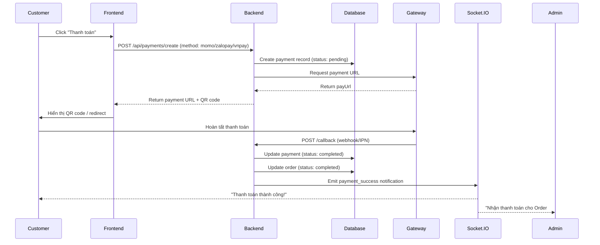
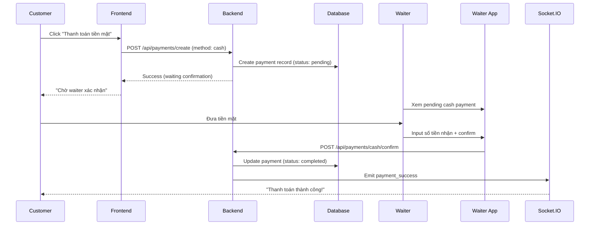

# 💳 TASK 3.1: TÍCH HỢP CÁC CỔNG THANH TOÁN

> **Thời gian ước tính:** 14-16 giờ  
> **Độ ưu tiên:** Critical  
> **Phụ thuộc:** Order system (hoàn thành), Database migration (bảng payments & payment_methods)

---

## 📋 TỔNG QUAN TASK

### **Mục tiêu:**
Tích hợp 4 phương thức thanh toán: **MoMo**, **ZaloPay**, **VNPay**, và **Tiền mặt** để customer có thể thanh toán order linh hoạt.

### **Các deliverables:**
- ✅ `POST /api/payments/create` - Tạo payment request (hỗ trợ 4 methods)
- ✅ `POST /api/payments/momo/callback` - Handle MoMo webhook
- ✅ `POST /api/payments/zalopay/callback` - Handle ZaloPay callback
- ✅ `POST /api/payments/vnpay/ipn` - Handle VNPay IPN
- ✅ `POST /api/payments/cash/confirm` - Xác nhận thanh toán tiền mặt
- ✅ `GET /api/payments/:orderId/status` - Kiểm tra trạng thái thanh toán
- ✅ Payment records trong database với payment_methods table
- ✅ Order status update sau khi payment thành công
- ✅ Real-time notifications cho customer & admin

### **Sơ đồ luồng (MoMo/ZaloPay/VNPay):**


### **Sơ đồ luồng (Tiền mặt):**


---

## 🗄️ DATABASE SCHEMA

### **1. Tạo Migration: `prisma/migrations/004_add_payment_methods.sql`**

```sql
-- ========================================
-- 1. Tạo bảng payment_methods
-- ========================================
CREATE TABLE payment_methods (
  id UUID PRIMARY KEY DEFAULT gen_random_uuid(),
  code VARCHAR(20) UNIQUE NOT NULL, -- 'momo', 'zalopay', 'vnpay', 'cash'
  name VARCHAR(50) NOT NULL, -- 'MoMo', 'ZaloPay', 'VNPay', 'Tiền mặt'
  description TEXT,
  logo_url VARCHAR(255),
  is_active BOOLEAN DEFAULT true,
  config JSONB, -- API credentials (encrypted)
  display_order INT DEFAULT 0,
  created_at TIMESTAMP DEFAULT CURRENT_TIMESTAMP,
  updated_at TIMESTAMP DEFAULT CURRENT_TIMESTAMP
);

-- ========================================
-- 2. Seed payment methods
-- ========================================
INSERT INTO payment_methods (code, name, description, logo_url, display_order) VALUES
('momo', 'MoMo', 'Ví điện tử MoMo - 40 triệu người dùng', 'https://developers.momo.vn/v3/img/logo.png', 1),
('zalopay', 'ZaloPay', 'Ví điện tử ZaloPay - Tích hợp Zalo', 'https://cdn.zalopay.vn/logo/zalopay.png', 2),
('vnpay', 'VNPay', 'Cổng thanh toán VNPay - ATM/Credit card', 'https://vnpay.vn/logo.png', 3),
('cash', 'Tiền mặt', 'Thanh toán tiền mặt tại quầy', NULL, 4);

-- ========================================
-- 3. Update bảng payments (nếu đã tồn tại)
-- ========================================
-- Drop old payments table if exists
DROP TABLE IF EXISTS payments CASCADE;

-- Create new payments table
CREATE TABLE payments (
  id UUID PRIMARY KEY DEFAULT gen_random_uuid(),
  order_id UUID NOT NULL REFERENCES orders(id) ON DELETE CASCADE,
  payment_method_id UUID NOT NULL REFERENCES payment_methods(id),
  amount DECIMAL(10, 2) NOT NULL,
  status VARCHAR(20) DEFAULT 'pending', -- pending, completed, failed, refunded
  
  -- Gateway fields (cho MoMo, ZaloPay, VNPay)
  gateway_request_id VARCHAR(100), -- RequestId/OrderId for tracking
  gateway_trans_id VARCHAR(100), -- Transaction ID from gateway
  gateway_response JSONB, -- Full response from gateway
  
  -- Cash payment fields
  received_by UUID REFERENCES users(id), -- Waiter ID who received cash
  cash_amount DECIMAL(10, 2), -- Actual cash received
  change_amount DECIMAL(10, 2), -- Change given back
  notes TEXT,
  
  -- Timestamps
  completed_at TIMESTAMP,
  failed_reason TEXT,
  refund_reason TEXT,
  refunded_at TIMESTAMP,
  refunded_by UUID REFERENCES users(id),
  
  created_at TIMESTAMP DEFAULT CURRENT_TIMESTAMP,
  updated_at TIMESTAMP DEFAULT CURRENT_TIMESTAMP
);

-- ========================================
-- 4. Indexes
-- ========================================
CREATE INDEX idx_payments_order ON payments(order_id);
CREATE INDEX idx_payments_status ON payments(status);
CREATE INDEX idx_payments_method ON payments(payment_method_id);
CREATE INDEX idx_payments_created ON payments(created_at);
CREATE INDEX idx_payments_gateway_request ON payments(gateway_request_id);
```

### **2. Update Prisma Schema: `prisma/schema.prisma`**

```prisma
// ========================================
// Payment Methods Table
// ========================================
model PaymentMethod {
  id          String   @id @default(uuid()) @db.Uuid
  code        String   @unique @db.VarChar(20)
  name        String   @db.VarChar(50)
  description String?
  logo_url    String?  @db.VarChar(255)
  is_active   Boolean  @default(true)
  config      Json?    // API credentials (encrypted)
  
  display_order Int    @default(0)
  created_at  DateTime @default(now())
  updated_at  DateTime @updatedAt
  
  payments    Payment[]
  
  @@map("payment_methods")
}

// ========================================
// Payments Table
// ========================================
model Payment {
  id                   String    @id @default(uuid()) @db.Uuid
  order_id             String    @db.Uuid
  payment_method_id    String    @db.Uuid
  amount               Decimal   @db.Decimal(10, 2)
  status               String    @default("pending") @db.VarChar(20)
  
  // Gateway fields (MoMo, ZaloPay, VNPay)
  gateway_request_id   String?   @db.VarChar(100)
  gateway_trans_id     String?   @db.VarChar(100)
  gateway_response     Json?
  
  // Cash payment fields
  received_by          String?   @db.Uuid
  cash_amount          Decimal?  @db.Decimal(10, 2)
  change_amount        Decimal?  @db.Decimal(10, 2)
  notes                String?
  
  completed_at         DateTime?
  failed_reason        String?
  refund_reason        String?
  refunded_at          DateTime?
  refunded_by          String?   @db.Uuid
  
  created_at           DateTime  @default(now())
  updated_at           DateTime  @updatedAt
  
  // Relations
  order                Order         @relation(fields: [order_id], references: [id], onDelete: Cascade)
  payment_method       PaymentMethod @relation(fields: [payment_method_id], references: [id])
  received_by_user     User?         @relation("ReceivedPayments", fields: [received_by], references: [id])
  refunded_by_user     User?         @relation("RefundedPayments", fields: [refunded_by], references: [id])
  
  @@index([order_id])
  @@index([status])
  @@index([payment_method_id])
  @@index([gateway_request_id])
  @@map("payments")
}

// ========================================
// Update User model (add payment relations)
// ========================================
model User {
  // ... existing fields ...
  
  received_payments Payment[] @relation("ReceivedPayments")
  refunded_payments Payment[] @relation("RefundedPayments")
}

// ========================================
// Update Order model (add payment relation)
// ========================================
model Order {
  // ... existing fields ...
  
  payments Payment[]
}
```

---

## 🔧 IMPLEMENTATION

### **Step 1: Tạo Payments Module**

```bash
cd backend/src

# Create module structure
nest g module payments
nest g controller payments
nest g service payments

# Create gateway services
nest g service payments/momo
nest g service payments/zalopay
nest g service payments/vnpay
nest g service payments/cash
```

**Files created:**
- `backend/src/payments/payments.module.ts`
- `backend/src/payments/payments.controller.ts`
- `backend/src/payments/payments.service.ts`
- `backend/src/payments/momo.service.ts`
- `backend/src/payments/zalopay.service.ts`
- `backend/src/payments/vnpay.service.ts`
- `backend/src/payments/cash.service.ts`

---

### **Step 2: Tạo DTOs**

#### **File:** `backend/src/payments/dto/create-payment.dto.ts`

```typescript
import { IsUUID, IsString, IsOptional, IsIn } from 'class-validator';

export class CreatePaymentDto {
  @IsUUID()
  order_id: string;

  @IsString()
  @IsIn(['momo', 'zalopay', 'vnpay', 'cash'])
  method: string; // Required: select payment method

  @IsString()
  @IsOptional()
  return_url?: string; // URL to redirect after payment (for online methods)
}
```

#### **File:** `backend/src/payments/dto/momo-callback.dto.ts`

```typescript
export class MoMoCallbackDto {
  partnerCode: string;
  orderId: string; // Our payment ID
  requestId: string;
  amount: number;
  orderInfo: string;
  orderType: string;
  transId: number; // MoMo transaction ID
  resultCode: number; // 0 = success
  message: string;
  payType: string;
  responseTime: number;
  extraData: string;
  signature: string;
}
```

#### **File:** `backend/src/payments/dto/zalopay-callback.dto.ts`

```typescript
export class ZaloPayCallbackDto {
  data: string; // JSON string
  mac: string; // MAC signature
}

export interface ZaloPayCallbackData {
  app_id: number;
  app_trans_id: string; // Our payment ID
  app_time: number;
  app_user: string;
  amount: number;
  embed_data: string;
  item: string;
  zp_trans_id: number; // ZaloPay transaction ID
  server_time: number;
  channel: number;
  merchant_user_id: string;
}
```

#### **File:** `backend/src/payments/dto/vnpay-ipn.dto.ts`

```typescript
export class VNPayIPNDto {
  vnp_Amount: string;
  vnp_BankCode: string;
  vnp_BankTranNo: string;
  vnp_CardType: string;
  vnp_OrderInfo: string;
  vnp_PayDate: string;
  vnp_ResponseCode: string; // '00' = success
  vnp_TmnCode: string;
  vnp_TransactionNo: string; // VNPay transaction ID
  vnp_TransactionStatus: string;
  vnp_TxnRef: string; // Our payment ID
  vnp_SecureHash: string; // Signature
}
```

#### **File:** `backend/src/payments/dto/cash-confirm.dto.ts`

```typescript
import { IsUUID, IsNumber, IsString, IsOptional, Min } from 'class-validator';

export class CashConfirmDto {
  @IsUUID()
  payment_id: string;

  @IsNumber()
  @Min(0)
  cash_amount: number; // Tiền khách đưa

  @IsString()
  @IsOptional()
  notes?: string; // Ghi chú (optional)
}
```

---

### **Step 3: MoMo Service**

#### **File:** `backend/src/payments/momo.service.ts`

```typescript
import { Injectable, Logger } from '@nestjs/common';
import * as crypto from 'crypto-js';
import axios from 'axios';

@Injectable()
export class MoMoService {
  private readonly logger = new Logger(MoMOService.name);
  private readonly partnerCode: string;
  private readonly accessKey: string;
  private readonly secretKey: string;
  private readonly endpoint: string;

  constructor() {
    this.partnerCode = process.env.MOMO_PARTNER_CODE;
    this.accessKey = process.env.MOMO_ACCESS_KEY;
    this.secretKey = process.env.MOMO_SECRET_KEY;
    this.endpoint = process.env.MOMO_API_URL;
  }

  /**
   * Tạo MoMo payment request
   */
  async createPayment(data: {
    orderId: string; // Payment ID
    amount: number;
    orderInfo: string;
    returnUrl: string;
    notifyUrl: string;
  }) {
    const requestId = `MOMO_${Date.now()}`;
    const requestType = 'captureWallet';
    const extraData = '';

    // Build raw signature (EXACT order từ MoMo docs)
    const rawSignature = `accessKey=${this.accessKey}&amount=${data.amount}&extraData=${extraData}&ipnUrl=${data.notifyUrl}&orderId=${data.orderId}&orderInfo=${data.orderInfo}&partnerCode=${this.partnerCode}&redirectUrl=${data.returnUrl}&requestId=${requestId}&requestType=${requestType}`;

    // Generate signature using HMAC SHA256
    const signature = crypto
      .HmacSHA256(rawSignature, this.secretKey)
      .toString();

    this.logger.log(`Creating MoMo payment: ${data.orderId}`);

    // Request body
    const requestBody = {
      partnerCode: this.partnerCode,
      accessKey: this.accessKey,
      requestId,
      amount: data.amount,
      orderId: data.orderId,
      orderInfo: data.orderInfo,
      redirectUrl: data.returnUrl,
      ipnUrl: data.notifyUrl,
      requestType,
      extraData,
      lang: 'vi',
      signature,
    };

    try {
      const response = await axios.post(this.endpoint, requestBody, {
        headers: { 'Content-Type': 'application/json' },
      });

      if (response.data.resultCode !== 0) {
        throw new Error(
          `MoMo error: ${response.data.message} (Code: ${response.data.resultCode})`,
        );
      }

      return {
        payUrl: response.data.payUrl,
        qrCodeUrl: response.data.qrCodeUrl,
        requestId,
      };
    } catch (error) {
      this.logger.error(`MoMo API error: ${error.message}`);
      throw error;
    }
  }

  /**
   * Verify MoMo callback signature
   */
  verifySignature(data: MoMoCallbackDto): boolean {
    const rawSignature = `accessKey=${this.accessKey}&amount=${data.amount}&extraData=${data.extraData}&message=${data.message}&orderId=${data.orderId}&orderInfo=${data.orderInfo}&orderType=${data.orderType}&partnerCode=${data.partnerCode}&payType=${data.payType}&requestId=${data.requestId}&responseTime=${data.responseTime}&resultCode=${data.resultCode}&transId=${data.transId}`;

    const expectedSignature = crypto
      .HmacSHA256(rawSignature, this.secretKey)
      .toString();

    return expectedSignature === data.signature;
  }
}
```

---

### **Step 4: ZaloPay Service**

#### **File:** `backend/src/payments/zalopay.service.ts`

```typescript
import { Injectable, Logger } from '@nestjs/common';
import * as crypto from 'crypto';
import axios from 'axios';
import * as moment from 'moment';

@Injectable()
export class ZaloPayService {
  private readonly logger = new Logger(ZaloPayService.name);
  private readonly appId: string;
  private readonly key1: string;
  private readonly key2: string;
  private readonly endpoint: string;

  constructor() {
    this.appId = process.env.ZALOPAY_APP_ID;
    this.key1 = process.env.ZALOPAY_KEY1;
    this.key2 = process.env.ZALOPAY_KEY2;
    this.endpoint = process.env.ZALOPAY_API_URL;
  }

  /**
   * Tạo ZaloPay order
   */
  async createOrder(data: {
    orderId: string; // Payment ID
    amount: number;
    description: string;
    callbackUrl: string;
  }) {
    const app_trans_id = `${moment().format('YYMMDD')}_${data.orderId}`;
    const embed_data = JSON.stringify({});
    const items = JSON.stringify([]);
    const app_time = Date.now();

    // Build MAC (Message Authentication Code)
    const macData = `${this.appId}|${app_trans_id}|${data.amount}|${data.description}|${app_time}|${embed_data}|${items}`;
    const mac = crypto
      .createHmac('sha256', this.key1)
      .update(macData)
      .digest('hex');

    this.logger.log(`Creating ZaloPay order: ${app_trans_id}`);

    const orderData = {
      app_id: this.appId,
      app_trans_id,
      app_user: 'user123', // Customer ID
      amount: data.amount,
      app_time,
      embed_data,
      item: items,
      description: data.description,
      callback_url: data.callbackUrl,
      mac,
    };

    try {
      const response = await axios.post(this.endpoint, orderData, {
        headers: { 'Content-Type': 'application/x-www-form-urlencoded' },
      });

      if (response.data.return_code !== 1) {
        throw new Error(
          `ZaloPay error: ${response.data.return_message} (Code: ${response.data.return_code})`,
        );
      }

      return {
        orderUrl: response.data.order_url,
        zpTransToken: response.data.zp_trans_token,
        appTransId: app_trans_id,
      };
    } catch (error) {
      this.logger.error(`ZaloPay API error: ${error.message}`);
      throw error;
    }
  }

  /**
   * Verify ZaloPay callback MAC
   */
  verifyCallback(data: string, receivedMac: string): boolean {
    const expectedMac = crypto
      .createHmac('sha256', this.key2)
      .update(data)
      .digest('hex');

    return expectedMac === receivedMac;
  }
}
```

---

### **Step 5: VNPay Service**

#### **File:** `backend/src/payments/vnpay.service.ts`

```typescript
import { Injectable, Logger } from '@nestjs/common';
import * as crypto from 'crypto';
import * as querystring from 'querystring';
import * as moment from 'moment';

@Injectable()
export class VNPayService {
  private readonly logger = new Logger(VNPayService.name);
  private readonly tmnCode: string;
  private readonly hashSecret: string;
  private readonly url: string;
  private readonly returnUrl: string;

  constructor() {
    this.tmnCode = process.env.VNPAY_TMN_CODE;
    this.hashSecret = process.env.VNPAY_HASH_SECRET;
    this.url = process.env.VNPAY_API_URL;
    this.returnUrl = process.env.VNPAY_RETURN_URL;
  }

  /**
   * Tạo VNPay payment URL
   */
  createPaymentUrl(data: {
    orderId: string; // Payment ID
    amount: number;
    orderInfo: string;
    ipAddr: string;
  }): string {
    const createDate = moment().format('YYYYMMDDHHmmss');
    const txnRef = data.orderId;

    // VNPay requires amount in VND with no decimal (multiply by 100)
    const amount = data.amount * 100;

    let vnp_Params: any = {
      vnp_Version: '2.1.0',
      vnp_Command: 'pay',
      vnp_TmnCode: this.tmnCode,
      vnp_Locale: 'vn',
      vnp_CurrCode: 'VND',
      vnp_TxnRef: txnRef,
      vnp_OrderInfo: data.orderInfo,
      vnp_OrderType: 'other',
      vnp_Amount: amount,
      vnp_ReturnUrl: this.returnUrl,
      vnp_IpAddr: data.ipAddr,
      vnp_CreateDate: createDate,
    };

    // Sort params by key
    vnp_Params = this.sortObject(vnp_Params);

    // Build query string
    const signData = querystring.stringify(vnp_Params);

    // Generate SecureHash
    const secureHash = crypto
      .createHmac('sha512', this.hashSecret)
      .update(Buffer.from(signData, 'utf-8'))
      .digest('hex');

    vnp_Params['vnp_SecureHash'] = secureHash;

    const paymentUrl = this.url + '?' + querystring.stringify(vnp_Params);

    this.logger.log(`Created VNPay payment URL for: ${txnRef}`);
    return paymentUrl;
  }

  /**
   * Verify VNPay IPN signature
   */
  verifyIPN(vnp_Params: any): boolean {
    const secureHash = vnp_Params['vnp_SecureHash'];
    delete vnp_Params['vnp_SecureHash'];
    delete vnp_Params['vnp_SecureHashType'];

    const sortedParams = this.sortObject(vnp_Params);
    const signData = querystring.stringify(sortedParams);

    const expectedHash = crypto
      .createHmac('sha512', this.hashSecret)
      .update(Buffer.from(signData, 'utf-8'))
      .digest('hex');

    return secureHash === expectedHash;
  }

  /**
   * Sort object by key
   */
  private sortObject(obj: any): any {
    const sorted: any = {};
    const keys = Object.keys(obj).sort();
    keys.forEach((key) => {
      sorted[key] = obj[key];
    });
    return sorted;
  }
}
```

---

### **Step 6: Cash Payment Service**

#### **File:** `backend/src/payments/cash.service.ts`

```typescript
import { Injectable, Logger } from '@nestjs/common';

@Injectable()
export class CashPaymentService {
  private readonly logger = new Logger(CashPaymentService.name);

  /**
   * Tính tiền thối lại
   */
  calculateChange(orderAmount: number, cashReceived: number): number {
    if (cashReceived < orderAmount) {
      throw new Error('Số tiền nhận không đủ để thanh toán');
    }
    return cashReceived - orderAmount;
  }

  /**
   * Validate cash payment
   */
  validateCashPayment(data: {
    orderAmount: number;
    cashAmount: number;
  }): { isValid: boolean; changeAmount: number; error?: string } {
    if (data.cashAmount < data.orderAmount) {
      return {
        isValid: false,
        changeAmount: 0,
        error: `Số tiền nhận (${data.cashAmount.toLocaleString('vi-VN')}đ) không đủ. Cần ${data.orderAmount.toLocaleString('vi-VN')}đ`,
      };
    }

    const change = this.calculateChange(data.orderAmount, data.cashAmount);
    this.logger.log(
      `Cash payment validated: Amount=${data.orderAmount}, Received=${data.cashAmount}, Change=${change}`,
    );

    return {
      isValid: true,
      changeAmount: change,
    };
  }
}
```

---

### **Step 7: Main Payments Service**

#### **File:** `backend/src/payments/payments.service.ts`

```typescript
import {
  Injectable,
  Logger,
  NotFoundException,
  BadRequestException,
} from '@nestjs/common';
import { PrismaService } from '../prisma/prisma.service';
import { MoMoService } from './momo.service';
import { ZaloPayService } from './zalopay.service';
import { VNPayService } from './vnpay.service';
import { CashPaymentService } from './cash.service';
import { NotificationsService } from '../notifications/notifications.service';
import { CreatePaymentDto } from './dto/create-payment.dto';
import { CashConfirmDto } from './dto/cash-confirm.dto';

@Injectable()
export class PaymentsService {
  private readonly logger = new Logger(PaymentsService.name);

  constructor(
    private prisma: PrismaService,
    private momoService: MoMoService,
    private zalopayService: ZaloPayService,
    private vnpayService: VNPayService,
    private cashService: CashPaymentService,
    private notificationsService: NotificationsService,
  ) {}

  /**
   * Tạo payment request
   */
  async createPayment(dto: CreatePaymentDto, userId: string) {
    // 1. Validate order
    const order = await this.prisma.order.findUnique({
      where: { id: dto.order_id },
      include: { items: true },
    });

    if (!order) {
      throw new NotFoundException('Order không tồn tại');
    }

    if (order.status !== 'served') {
      throw new BadRequestException(
        'Chỉ có thể thanh toán order đã served',
      );
    }

    // 2. Get payment method
    const paymentMethod = await this.prisma.paymentMethod.findUnique({
      where: { code: dto.method },
    });

    if (!paymentMethod || !paymentMethod.is_active) {
      throw new BadRequestException('Phương thức thanh toán không khả dụng');
    }

    // 3. Create payment record
    const payment = await this.prisma.payment.create({
      data: {
        order_id: dto.order_id,
        payment_method_id: paymentMethod.id,
        amount: order.total_amount,
        status: 'pending',
      },
    });

    // 4. Generate payment URL/info based on method
    let paymentInfo: any;

    try {
      switch (dto.method) {
        case 'momo':
          paymentInfo = await this.momoService.createPayment({
            orderId: payment.id,
            amount: Number(order.total_amount),
            orderInfo: `Thanh toán Order #${order.id}`,
            returnUrl: dto.return_url || process.env.MOMO_REDIRECT_URL,
            notifyUrl: `${process.env.BACKEND_URL}/api/payments/momo/callback`,
          });
          break;

        case 'zalopay':
          paymentInfo = await this.zalopayService.createOrder({
            orderId: payment.id,
            amount: Number(order.total_amount),
            description: `Thanh toán Order #${order.id}`,
            callbackUrl: `${process.env.BACKEND_URL}/api/payments/zalopay/callback`,
          });
          break;

        case 'vnpay':
          paymentInfo = {
            paymentUrl: this.vnpayService.createPaymentUrl({
              orderId: payment.id,
              amount: Number(order.total_amount),
              orderInfo: `Thanh toán Order #${order.id}`,
              ipAddr: '127.0.0.1', // Get from request
            }),
          };
          break;

        case 'cash':
          // Không cần generate URL, chỉ tạo payment record
          paymentInfo = {
            message: 'Chờ waiter xác nhận thanh toán tiền mặt',
            paymentId: payment.id,
          };

          // Notify waiter
          await this.notificationsService.sendNotification({
            restaurant_id: order.restaurant_id,
            user_id: null, // Broadcast to all waiters
            type: 'CASH_PAYMENT_PENDING',
            message: `Order #${order.id} chờ xác nhận thanh toán tiền mặt`,
            metadata: {
              order_id: order.id,
              payment_id: payment.id,
              amount: order.total_amount,
            },
          });
          break;

        default:
          throw new BadRequestException('Phương thức thanh toán không hợp lệ');
      }

      // 5. Update payment with request ID (for online methods)
      if (dto.method !== 'cash') {
        await this.prisma.payment.update({
          where: { id: payment.id },
          data: {
            gateway_request_id:
              paymentInfo.requestId ||
              paymentInfo.appTransId ||
              payment.id,
          },
        });
      }

      this.logger.log(`Payment created: ${payment.id} (method: ${dto.method})`);

      return {
        payment_id: payment.id,
        method: dto.method,
        amount: order.total_amount,
        ...paymentInfo,
      };
    } catch (error) {
      // Rollback: mark payment as failed
      await this.prisma.payment.update({
        where: { id: payment.id },
        data: {
          status: 'failed',
          failed_reason: error.message,
        },
      });

      throw error;
    }
  }

  /**
   * Xác nhận thanh toán tiền mặt (Waiter only)
   */
  async confirmCashPayment(dto: CashConfirmDto, waiterId: string) {
    // 1. Get payment
    const payment = await this.prisma.payment.findUnique({
      where: { id: dto.payment_id },
      include: {
        order: true,
        payment_method: true,
      },
    });

    if (!payment) {
      throw new NotFoundException('Payment không tồn tại');
    }

    if (payment.payment_method.code !== 'cash') {
      throw new BadRequestException(
        'Chỉ có thể confirm cash payment',
      );
    }

    if (payment.status !== 'pending') {
      throw new BadRequestException(
        `Payment đã ${payment.status}`,
      );
    }

    // 2. Validate cash amount
    const validation = this.cashService.validateCashPayment({
      orderAmount: Number(payment.amount),
      cashAmount: dto.cash_amount,
    });

    if (!validation.isValid) {
      throw new BadRequestException(validation.error);
    }

    // 3. Update payment
    await this.prisma.payment.update({
      where: { id: payment.id },
      data: {
        status: 'completed',
        received_by: waiterId,
        cash_amount: dto.cash_amount,
        change_amount: validation.changeAmount,
        notes: dto.notes,
        completed_at: new Date(),
      },
    });

    // 4. Update order status
    await this.prisma.order.update({
      where: { id: payment.order_id },
      data: {
        status: 'completed',
        completed_at: new Date(),
      },
    });

    // 5. Send notifications
    await this.notificationsService.sendNotification({
      restaurant_id: payment.order.restaurant_id,
      user_id: payment.order.customer_id,
      type: 'PAYMENT_SUCCESS',
      message: `Thanh toán Order #${payment.order.id} thành công`,
      metadata: {
        order_id: payment.order.id,
        payment_id: payment.id,
        amount: payment.amount,
        method: 'cash',
      },
    });

    this.logger.log(`Cash payment confirmed: ${payment.id} by waiter ${waiterId}`);

    return {
      payment_id: payment.id,
      order_id: payment.order_id,
      amount: payment.amount,
      cash_received: dto.cash_amount,
      change: validation.changeAmount,
      status: 'completed',
    };
  }

  /**
   * Handle MoMo callback
   */
  async handleMoMoCallback(callbackData: any) {
    // 1. Verify signature
    const isValid = this.momoService.verifySignature(callbackData);
    if (!isValid) {
      throw new BadRequestException('Invalid signature');
    }

    // 2. Get payment
    const payment = await this.prisma.payment.findFirst({
      where: { id: callbackData.orderId },
      include: { order: true },
    });

    if (!payment) {
      throw new NotFoundException('Payment not found');
    }

    // 3. Update payment
    const isSuccess = callbackData.resultCode === 0;
    await this.prisma.payment.update({
      where: { id: payment.id },
      data: {
        status: isSuccess ? 'completed' : 'failed',
        gateway_trans_id: callbackData.transId.toString(),
        gateway_response: callbackData,
        completed_at: isSuccess ? new Date() : null,
        failed_reason: isSuccess ? null : callbackData.message,
      },
    });

    // 4. Update order if success
    if (isSuccess) {
      await this.prisma.order.update({
        where: { id: payment.order_id },
        data: {
          status: 'completed',
          completed_at: new Date(),
        },
      });

      // Send notification
      await this.notificationsService.sendNotification({
        restaurant_id: payment.order.restaurant_id,
        user_id: payment.order.customer_id,
        type: 'PAYMENT_SUCCESS',
        message: `Thanh toán MoMo thành công cho Order #${payment.order.id}`,
        metadata: {
          order_id: payment.order.id,
          payment_id: payment.id,
        },
      });
    }

    this.logger.log(`MoMo callback processed: ${payment.id} - ${isSuccess ? 'SUCCESS' : 'FAILED'}`);
  }

  /**
   * Handle ZaloPay callback
   */
  async handleZaloPayCallback(data: string, mac: string) {
    // 1. Verify MAC
    const isValid = this.zalopayService.verifyCallback(data, mac);
    if (!isValid) {
      throw new BadRequestException('Invalid MAC');
    }

    // 2. Parse data
    const callbackData = JSON.parse(data);
    const paymentId = callbackData.app_trans_id.split('_')[1]; // Extract payment ID

    // 3. Get payment
    const payment = await this.prisma.payment.findFirst({
      where: { id: paymentId },
      include: { order: true },
    });

    if (!payment) {
      throw new NotFoundException('Payment not found');
    }

    // 4. Update payment (ZaloPay callback chỉ gửi khi success)
    await this.prisma.payment.update({
      where: { id: payment.id },
      data: {
        status: 'completed',
        gateway_trans_id: callbackData.zp_trans_id.toString(),
        gateway_response: callbackData,
        completed_at: new Date(),
      },
    });

    // 5. Update order
    await this.prisma.order.update({
      where: { id: payment.order_id },
      data: {
        status: 'completed',
        completed_at: new Date(),
      },
    });

    // 6. Send notification
    await this.notificationsService.sendNotification({
      restaurant_id: payment.order.restaurant_id,
      user_id: payment.order.customer_id,
      type: 'PAYMENT_SUCCESS',
      message: `Thanh toán ZaloPay thành công cho Order #${payment.order.id}`,
      metadata: {
        order_id: payment.order.id,
        payment_id: payment.id,
      },
    });

    this.logger.log(`ZaloPay callback processed: ${payment.id} - SUCCESS`);
  }

  /**
   * Handle VNPay IPN
   */
  async handleVNPayIPN(vnp_Params: any) {
    // 1. Verify signature
    const isValid = this.vnpayService.verifyIPN(vnp_Params);
    if (!isValid) {
      return { RspCode: '97', Message: 'Invalid signature' };
    }

    // 2. Get payment
    const payment = await this.prisma.payment.findFirst({
      where: { id: vnp_Params.vnp_TxnRef },
      include: { order: true },
    });

    if (!payment) {
      return { RspCode: '01', Message: 'Order not found' };
    }

    // 3. Check amount
    const expectedAmount = Number(payment.amount) * 100; // VNPay amount in VND
    if (Number(vnp_Params.vnp_Amount) !== expectedAmount) {
      return { RspCode: '04', Message: 'Invalid amount' };
    }

    // 4. Update payment
    const isSuccess = vnp_Params.vnp_ResponseCode === '00';
    await this.prisma.payment.update({
      where: { id: payment.id },
      data: {
        status: isSuccess ? 'completed' : 'failed',
        gateway_trans_id: vnp_Params.vnp_TransactionNo,
        gateway_response: vnp_Params,
        completed_at: isSuccess ? new Date() : null,
        failed_reason: isSuccess ? null : 'VNPay transaction failed',
      },
    });

    // 5. Update order if success
    if (isSuccess) {
      await this.prisma.order.update({
        where: { id: payment.order_id },
        data: {
          status: 'completed',
          completed_at: new Date(),
        },
      });

      // Send notification
      await this.notificationsService.sendNotification({
        restaurant_id: payment.order.restaurant_id,
        user_id: payment.order.customer_id,
        type: 'PAYMENT_SUCCESS',
        message: `Thanh toán VNPay thành công cho Order #${payment.order.id}`,
        metadata: {
          order_id: payment.order.id,
          payment_id: payment.id,
        },
      });
    }

    this.logger.log(`VNPay IPN processed: ${payment.id} - ${isSuccess ? 'SUCCESS' : 'FAILED'}`);

    return { RspCode: '00', Message: 'Success' };
  }

  /**
   * Get payment status
   */
  async getPaymentStatus(orderId: string) {
    const payment = await this.prisma.payment.findFirst({
      where: { order_id: orderId },
      include: {
        payment_method: true,
        order: true,
      },
      orderBy: { created_at: 'desc' },
    });

    if (!payment) {
      throw new NotFoundException('Payment không tồn tại');
    }

    return {
      payment_id: payment.id,
      order_id: payment.order_id,
      method: payment.payment_method.name,
      amount: payment.amount,
      status: payment.status,
      completed_at: payment.completed_at,
      failed_reason: payment.failed_reason,
    };
  }

  /**
   * Get active payment methods
   */
  async getPaymentMethods() {
    return this.prisma.paymentMethod.findMany({
      where: { is_active: true },
      orderBy: { display_order: 'asc' },
      select: {
        id: true,
        code: true,
        name: true,
        description: true,
        logo_url: true,
      },
    });
  }
}
```

---

### **Step 8: Payments Controller**

#### **File:** `backend/src/payments/payments.controller.ts`

```typescript
import {
  Controller,
  Post,
  Get,
  Body,
  Param,
  UseGuards,
  Req,
  HttpCode,
  HttpStatus,
} from '@nestjs/common';
import { PaymentsService } from './payments.service';
import { JwtAuthGuard } from '../auth/guards/jwt-auth.guard';
import { RolesGuard } from '../auth/guards/roles.guard';
import { Roles } from '../auth/decorators/roles.decorator';
import { CreatePaymentDto } from './dto/create-payment.dto';
import { CashConfirmDto } from './dto/cash-confirm.dto';

@Controller('payments')
export class PaymentsController {
  constructor(private readonly paymentsService: PaymentsService) {}

  /**
   * Tạo payment (Customer)
   */
  @Post('create')
  @UseGuards(JwtAuthGuard)
  async createPayment(@Body() dto: CreatePaymentDto, @Req() req: any) {
    return this.paymentsService.createPayment(dto, req.user.id);
  }

  /**
   * Xác nhận cash payment (Waiter only)
   */
  @Post('cash/confirm')
  @UseGuards(JwtAuthGuard, RolesGuard)
  @Roles('waiter', 'admin')
  async confirmCashPayment(@Body() dto: CashConfirmDto, @Req() req: any) {
    return this.paymentsService.confirmCashPayment(dto, req.user.id);
  }

  /**
   * MoMo callback (No auth - called by MoMo)
   */
  @Post('momo/callback')
  @HttpCode(HttpStatus.NO_CONTENT)
  async momoCallback(@Body() callbackData: any) {
    await this.paymentsService.handleMoMoCallback(callbackData);
  }

  /**
   * ZaloPay callback (No auth - called by ZaloPay)
   */
  @Post('zalopay/callback')
  @HttpCode(HttpStatus.OK)
  async zalopayCallback(@Body() body: { data: string; mac: string }) {
    await this.paymentsService.handleZaloPayCallback(body.data, body.mac);
    return { return_code: 1, return_message: 'success' };
  }

  /**
   * VNPay IPN (No auth - called by VNPay)
   */
  @Get('vnpay/ipn')
  async vnpayIPN(@Req() req: any) {
    return this.paymentsService.handleVNPayIPN(req.query);
  }

  /**
   * Get payment status
   */
  @Get(':orderId/status')
  @UseGuards(JwtAuthGuard)
  async getPaymentStatus(@Param('orderId') orderId: string) {
    return this.paymentsService.getPaymentStatus(orderId);
  }

  /**
   * Get payment methods
   */
  @Get('methods')
  async getPaymentMethods() {
    return this.paymentsService.getPaymentMethods();
  }
}
```

---

### **Step 9: Module Configuration**

#### **File:** `backend/src/payments/payments.module.ts`

```typescript
import { Module } from '@nestjs/common';
import { PaymentsController } from './payments.controller';
import { PaymentsService } from './payments.service';
import { MoMoService } from './momo.service';
import { ZaloPayService } from './zalopay.service';
import { VNPayService } from './vnpay.service';
import { CashPaymentService } from './cash.service';
import { PrismaModule } from '../prisma/prisma.module';
import { NotificationsModule } from '../notifications/notifications.module';

@Module({
  imports: [PrismaModule, NotificationsModule],
  controllers: [PaymentsController],
  providers: [
    PaymentsService,
    MoMoService,
    ZaloPayService,
    VNPayService,
    CashPaymentService,
  ],
  exports: [PaymentsService],
})
export class PaymentsModule {}
```

---

## 🧪 TESTING

### **Test 1: MoMo Payment**

```bash
# Terminal 1: Start backend with ngrok
cd backend
npm run start:dev

# Terminal 2: Expose with ngrok
ngrok http 3000

# Update .env with ngrok URL
MOMO_IPN_URL=https://your-ngrok-url.ngrok.io/api/payments/momo/callback

# Test create payment
curl -X POST http://localhost:3000/api/payments/create \
  -H "Authorization: Bearer YOUR_JWT_TOKEN" \
  -H "Content-Type: application/json" \
  -d '{
    "order_id": "uuid-here",
    "method": "momo"
  }'

# Response:
# {
#   "payment_id": "...",
#   "method": "momo",
#   "payUrl": "https://test-payment.momo.vn/...",
#   "qrCodeUrl": "https://test-payment.momo.vn/qr/..."
# }

# Scan QR code with MoMo app sandbox
# MoMo will call webhook → Payment completed
```

### **Test 2: ZaloPay Payment**

```bash
curl -X POST http://localhost:3000/api/payments/create \
  -H "Authorization: Bearer YOUR_JWT_TOKEN" \
  -H "Content-Type: application/json" \
  -d '{
    "order_id": "uuid-here",
    "method": "zalopay"
  }'

# Response:
# {
#   "payment_id": "...",
#   "method": "zalopay",
#   "orderUrl": "https://sb-openapi.zalopay.vn/...",
#   "zpTransToken": "..."
# }
```

### **Test 3: VNPay Payment**

```bash
curl -X POST http://localhost:3000/api/payments/create \
  -H "Authorization: Bearer YOUR_JWT_TOKEN" \
  -H "Content-Type: application/json" \
  -d '{
    "order_id": "uuid-here",
    "method": "vnpay"
  }'

# Response:
# {
#   "payment_id": "...",
#   "method": "vnpay",
#   "paymentUrl": "https://sandbox.vnpayment.vn/..."
# }
```

### **Test 4: Cash Payment**

```bash
# Step 1: Customer creates cash payment
curl -X POST http://localhost:3000/api/payments/create \
  -H "Authorization: Bearer CUSTOMER_TOKEN" \
  -H "Content-Type: application/json" \
  -d '{
    "order_id": "uuid-here",
    "method": "cash"
  }'

# Response:
# {
#   "payment_id": "payment-uuid",
#   "method": "cash",
#   "message": "Chờ waiter xác nhận thanh toán tiền mặt"
# }

# Step 2: Waiter confirms payment
curl -X POST http://localhost:3000/api/payments/cash/confirm \
  -H "Authorization: Bearer WAITER_TOKEN" \
  -H "Content-Type: application/json" \
  -d '{
    "payment_id": "payment-uuid",
    "cash_amount": 500000,
    "notes": "Khách trả 500k"
  }'

# Response:
# {
#   "payment_id": "payment-uuid",
#   "order_id": "order-uuid",
#   "amount": 450000,
#   "cash_received": 500000,
#   "change": 50000,
#   "status": "completed"
# }
```

---

## 🔐 ENVIRONMENT VARIABLES

```bash
# backend/.env

# ========== MoMo Configuration ==========
MOMO_PARTNER_CODE="MOMOBKUN20180529"
MOMO_ACCESS_KEY="klm05TvNBzhg7h7j"
MOMO_SECRET_KEY="at67qH6mk8w5Y1nAyMoYKMWACiEi2bsa"
MOMO_API_URL="https://test-payment.momo.vn/v2/gateway/api"
MOMO_REDIRECT_URL="http://localhost:5173/payment-result"
MOMO_IPN_URL="https://your-ngrok-url.ngrok.io/api/payments/momo/callback"

# ========== ZaloPay Configuration ==========
ZALOPAY_APP_ID="2553"
ZALOPAY_KEY1="PcY4iZIKFCIdgZvA6ueMcMHHUbRLYjPL"
ZALOPAY_KEY2="kLtgPl8HHhfvMuDHPwKfgfsY4Ydm9eIz"
ZALOPAY_API_URL="https://sb-openapi.zalopay.vn/v2/create"
ZALOPAY_CALLBACK_URL="https://your-ngrok-url.ngrok.io/api/payments/zalopay/callback"

# ========== VNPay Configuration ==========
VNPAY_TMN_CODE="DEMOVNPA"
VNPAY_HASH_SECRET="EKOMYZHBPCTMXWKHXBFAVKUJGTZJQUXI"
VNPAY_API_URL="https://sandbox.vnpayment.vn/paymentv2/vpcpay.html"
VNPAY_RETURN_URL="http://localhost:5173/payment-result"
VNPAY_IPN_URL="https://your-ngrok-url.ngrok.io/api/payments/vnpay/ipn"

# ========== General ==========
BACKEND_URL="http://localhost:3000"
CASH_PAYMENT_ENABLED=true
```

---

## 📊 GIT COMMITS (12-14 commits)

```bash
git checkout -b feature/sprint3-task-3.1-payment-gateway develop

# Database & Module Setup (3 commits)
git add .
git commit -m "feat(payment): tạo cấu trúc module payments với DTOs"

git add prisma/
git commit -m "feat(database): thêm bảng payment_methods và payments"

git add prisma/
git commit -m "feat(database): seed payment methods (momo, zalopay, vnpay, cash)"

# MoMo Integration (2 commits)
git add src/payments/momo.service.ts
git commit -m "feat(payment): implement MoMo service với signature generation"

git add src/payments/payments.service.ts src/payments/payments.controller.ts
git commit -m "feat(payment): thêm MoMo webhook callback handler"

# ZaloPay Integration (2 commits)
git add src/payments/zalopay.service.ts
git commit -m "feat(payment): implement ZaloPay service với MAC generation"

git add src/payments/payments.service.ts src/payments/payments.controller.ts
git commit -m "feat(payment): thêm ZaloPay callback handler"

# VNPay Integration (2 commits)
git add src/payments/vnpay.service.ts
git commit -m "feat(payment): implement VNPay service với SecureHash"

git add src/payments/payments.service.ts src/payments/payments.controller.ts
git commit -m "feat(payment): thêm VNPay IPN handler"

# Cash Payment (2 commits)
git add src/payments/cash.service.ts
git commit -m "feat(payment): implement cash payment service với change calculation"

git add src/payments/payments.service.ts src/payments/payments.controller.ts
git commit -m "feat(payment): thêm waiter confirmation cho cash payment"

# Integration & Module (1 commit)
git add src/payments/payments.module.ts src/app.module.ts
git commit -m "feat(payment): tích hợp payments module vào app"

# Testing & Documentation (2 commits)
git add src/payments/**/*.spec.ts
git commit -m "test(payment): thêm unit tests cho payment services"

git add docs/
git commit -m "docs(payment): viết hướng dẫn setup payment gateways"
```

---

## ✅ CHECKLIST VỚI GIẢI THÍCH CHI TIẾT

### **📦 Phase 1: Database Setup (1-2 giờ)**

#### **1.1 Tạo migration: `004_add_payment_methods.sql`**
- [ ] Tạo file migration trong `prisma/migrations/`
- [ ] Copy SQL code từ section "DATABASE SCHEMA" trong guide này

**💡 Ý nghĩa:** 
- Tạo bảng `payment_methods` để quản lý 4 phương thức thanh toán
- Tạo bảng `payments` với đầy đủ fields cho online & cash payments
- Tách biệt payment method config → dễ thêm/bớt methods sau này

**✅ Kết quả:** File SQL migration sẵn sàng để chạy

---

#### **1.2 Update Prisma schema với PaymentMethod & Payment models**
- [ ] Mở file `prisma/schema.prisma`
- [ ] Thêm model `PaymentMethod` (code từ guide)
- [ ] Update model `Payment` với gateway fields + cash fields + refund fields
- [ ] Update model `User` với payment relations
- [ ] Update model `Order` với payment relation

**💡 Ý nghĩa:**
- Prisma schema = "bản vẽ" database → Type-safe queries
- Relations giúp query dễ dàng: `payment.order`, `payment.payment_method`
- Optional fields (?) cho flexibility: cash_amount?, gateway_trans_id?

**✅ Kết quả:** Schema file updated, Prisma có thể generate types

---

#### **1.3 Run migration: `npm run migrate`**
- [ ] Terminal: `cd backend`
- [ ] Chạy: `npm run migrate` hoặc `npx prisma migrate dev`
- [ ] Xác nhận migration name khi được hỏi

**💡 Ý nghĩa:**
- Apply migration → Tạo tables thật trong database
- Prisma auto-generate TypeScript types từ schema
- Database structure ready cho implementation

**✅ Kết quả:** Tables `payment_methods` và `payments` tồn tại trong DB

---

#### **1.4 Seed payment methods**
- [ ] Chạy INSERT statements từ migration file
- [ ] Hoặc tạo seed script: `prisma/seed-payments.ts`
- [ ] Verify: Query database để check 4 methods đã tồn tại

**💡 Ý nghĩa:**
- Seed data = dữ liệu mặc định ban đầu
- 4 methods: momo, zalopay, vnpay, cash
- Mỗi method có code, name, description, display_order

**✅ Kết quả:** 4 payment methods trong bảng `payment_methods`

---

#### **1.5 Update PrismaService**
- [ ] Mở `backend/src/prisma/prisma.service.ts`
- [ ] ✅ **ĐÃ CÓ:** `this.payment = this.client.payments`
- [ ] ✅ **ĐÃ CÓ:** `this.paymentMethod = this.client.payment_methods`

**💡 Ý nghĩa:**
- Expose payment models qua PrismaService
- Dùng được: `this.prisma.payment.findMany()`, `this.prisma.paymentMethod.findUnique()`
- Consistent với cách access models khác (order, user, etc.)

**✅ Kết quả:** Payment models accessible trong services

---

### **🛠️ Phase 2: Payment Services (6-8 giờ)**

#### **2.1 Tạo payments module structure**
- [ ] `nest g module payments`
- [ ] `nest g controller payments`
- [ ] `nest g service payments`
- [ ] `nest g service payments/momo`
- [ ] `nest g service payments/zalopay`
- [ ] `nest g service payments/vnpay`
- [ ] `nest g service payments/cash`

**💡 Ý nghĩa:**
- Module pattern = tổ chức code gọn gàng
- Mỗi gateway có service riêng → Dễ maintain
- Main PaymentsService làm routing logic

**✅ Kết quả:** Folder structure:
```
payments/
├── payments.module.ts
├── payments.controller.ts
├── payments.service.ts
├── momo.service.ts
├── zalopay.service.ts
├── vnpay.service.ts
├── cash.service.ts
└── dto/
```

---

#### **2.2 Implement MoMoService**
- [ ] Tạo methods: `createPayment()`, `verifySignature()`
- [ ] HMAC SHA256 signature generation
- [ ] Axios POST request đến MoMo API
- [ ] Error handling

**💡 Ý nghĩa:**
- MoMo yêu cầu signature chính xác → Security
- Raw signature phải theo thứ tự exact từ docs
- Return `payUrl` và `qrCodeUrl` cho customer

**✅ Kết quả:** MoMo payment request hoạt động, nhận được QR code URL

---

#### **2.3 Implement ZaloPayService**
- [ ] Tạo methods: `createOrder()`, `verifyCallback()`
- [ ] MAC generation với crypto.createHmac()
- [ ] Handle ZaloPay response format

**💡 Ý nghĩa:**
- ZaloPay dùng MAC (Message Authentication Code) thay vì signature
- Format khác MoMo: zpTransToken, app_trans_id
- Callback verification quan trọng cho security

**✅ Kết quả:** ZaloPay order creation hoạt động

---

#### **2.4 Implement VNPayService**
- [ ] Tạo methods: `createPaymentUrl()`, `verifyIPN()`
- [ ] SecureHash SHA512 generation
- [ ] URL encoding cho params
- [ ] Sort params by key (VNPay requirement)

**💡 Ý nghĩa:**
- VNPay khác biệt: return URL thay vì API response
- Amount phải * 100 (VNPay tính bằng VND không có decimal)
- IPN (Instant Payment Notification) = webhook của VNPay

**✅ Kết quả:** VNPay payment URL generated correctly

---

#### **2.5 Implement CashPaymentService**
- [ ] Tạo method: `calculateChange()`
- [ ] Validation: cashAmount >= orderAmount
- [ ] Error messages rõ ràng

**💡 Ý nghĩa:**
- Cash payment đơn giản nhất: không cần API call
- Chỉ cần logic tính tiền thối
- Validation prevent waiter mistakes

**✅ Kết quả:** Cash payment calculation logic ready

---

#### **2.6 Implement PaymentsService (main)**
- [ ] Method `createPayment()`: Route to correct gateway service
- [ ] Method `handleMoMoCallback()`: Process MoMo webhook
- [ ] Method `handleZaloPayCallback()`: Process ZaloPay callback
- [ ] Method `handleVNPayIPN()`: Process VNPay IPN
- [ ] Method `confirmCashPayment()`: Waiter confirmation
- [ ] Method `getPaymentStatus()`: Check payment status
- [ ] Integration với OrdersService (update order status)
- [ ] Integration với NotificationsService (real-time updates)

**💡 Ý nghĩa:**
- Main service = "bộ não" điều phối tất cả gateways
- Switch case theo method: momo/zalopay/vnpay/cash
- Database transactions: Create payment → Update order → Send notification
- Error handling: Rollback if gateway fails

**✅ Kết quả:** Complete payment flow từ request → callback → complete

---

#### **2.7 Implement PaymentsController**
- [ ] `POST /api/payments/create` - Tạo payment (có auth)
- [ ] `POST /api/payments/momo/callback` - MoMo webhook (no auth)
- [ ] `POST /api/payments/zalopay/callback` - ZaloPay callback (no auth)
- [ ] `GET /api/payments/vnpay/ipn` - VNPay IPN (no auth)
- [ ] `POST /api/payments/cash/confirm` - Waiter confirm (auth + role)
- [ ] `GET /api/payments/:orderId/status` - Check status (có auth)
- [ ] `GET /api/payments/methods` - Get active methods (public)

**💡 Ý nghĩa:**
- Controller = entry point cho HTTP requests
- Webhook endpoints KHÔNG cần auth (gateways gọi trực tiếp)
- Role guards: cash confirm chỉ cho waiter/admin
- DTO validation automatic với class-validator

**✅ Kết quả:** All payment APIs accessible, properly secured

---

#### **2.8 Add role guards (waiter for cash confirm)**
- [ ] Import RolesGuard từ auth module
- [ ] Decorator @Roles('waiter', 'admin') cho cash endpoints
- [ ] Verify waiter có thể confirm, customer không thể

**💡 Ý nghĩa:**
- Security: Chỉ waiter mới confirm cash payments
- Prevent fraud: Customer không thể tự confirm payment của mình
- Admin có full access cho troubleshooting

**✅ Kết quả:** Cash payment security enforced

---

#### **2.9 Integrate with NotificationsService**
- [ ] Import NotificationsModule vào PaymentsModule
- [ ] Inject NotificationsService vào PaymentsService constructor
- [ ] Send notification sau mỗi payment success
- [ ] Send notification cho cash refund pending

**💡 Ý nghĩa:**
- Real-time updates: Customer biết payment thành công ngay
- Waiter receive alert: "Cash payment cần confirm"
- Admin monitoring: Track all payment events
- Socket.IO broadcast đến correct users

**✅ Kết quả:** Real-time payment notifications hoạt động

---

### **🌐 Phase 3: Environment Setup (1 giờ)**

#### **3.1 Đăng ký MoMo sandbox account**
- [ ] Truy cập: https://developers.momo.vn/
- [ ] Register account
- [ ] Get sandbox credentials: PARTNER_CODE, ACCESS_KEY, SECRET_KEY
- [ ] Copy vào .env

**💡 Ý nghĩa:**
- Sandbox = môi trường test, không charge tiền thật
- Credentials khác production → An toàn khi test

---

#### **3.2 Đăng ký ZaloPay sandbox account**
- [ ] Truy cập: https://docs.zalopay.vn/
- [ ] Get sandbox APP_ID, KEY1, KEY2
- [ ] Copy vào .env

---

#### **3.3 Đăng ký VNPay sandbox account**
- [ ] Truy cập: https://sandbox.vnpayment.vn/
- [ ] Get sandbox TMN_CODE, HASH_SECRET
- [ ] Copy vào .env

---

#### **3.4 Setup ngrok cho webhook/IPN**
- [ ] Download ngrok: https://ngrok.com/
- [ ] Run: `ngrok http 3000`
- [ ] Copy public URL (vd: https://abc123.ngrok.io)
- [ ] Update .env:
  ```
  MOMO_IPN_URL=https://abc123.ngrok.io/api/payments/momo/callback
  ZALOPAY_CALLBACK_URL=https://abc123.ngrok.io/api/payments/zalopay/callback
  VNPAY_IPN_URL=https://abc123.ngrok.io/api/payments/vnpay/ipn
  ```

**💡 Ý nghĩa:**
- Gateways cần public URL để gọi webhook
- Localhost không public → Dùng ngrok làm tunnel
- Production: Không cần ngrok, dùng domain thật

**⚠️ Lưu ý:** Mỗi lần restart ngrok → URL thay đổi → Phải update .env

---

#### **3.5 Configure .env với credentials**
- [ ] Paste tất cả credentials vào backend/.env
- [ ] Verify format: KEY="value" (có quotes)
- [ ] Restart backend để load env variables

**💡 Ý nghĩa:**
- Environment variables = configuration không hard-code
- Git ignore .env → Secrets không leak

**✅ Kết quả:** Backend có đủ credentials để gọi gateways

---

### **🧪 Phase 4: Testing (3-4 giờ)**

#### **4.1 Test MoMo payment flow**
- [ ] Create payment với method="momo"
- [ ] Nhận được payUrl và qrCodeUrl
- [ ] Scan QR code bằng MoMo app sandbox
- [ ] Complete payment trong app
- [ ] Verify webhook được gọi (check backend logs)
- [ ] Verify payment status = completed trong DB
- [ ] Verify order status = completed
- [ ] Verify customer nhận notification

**💡 Ý nghĩa:**
- End-to-end test: Từ request → gateway → webhook → complete
- MoMo sandbox: Dùng test account, không charge tiền
- Logs quan trọng: Check signature validation, API responses

**✅ Pass criteria:** Payment completed, order updated, notification sent

---

#### **4.2 Test ZaloPay payment flow**
- [ ] Similar steps như MoMo
- [ ] Verify ZaloPay callback được process
- [ ] Check MAC verification

---

#### **4.3 Test VNPay payment flow**
- [ ] Create payment với method="vnpay"
- [ ] Redirect đến VNPay URL
- [ ] Complete payment (sandbox test card)
- [ ] Verify IPN được gọi
- [ ] Check SecureHash verification

---

#### **4.4 Test cash payment flow**
- [ ] Customer create payment với method="cash"
- [ ] Verify payment status = pending
- [ ] Waiter login, view pending payments
- [ ] Waiter confirm với cash_amount
- [ ] Verify change_amount tính đúng
- [ ] Verify payment status = completed
- [ ] Verify customer nhận notification

**💡 Ý nghĩa:**
- Cash flow khác: 2-step process
- Test role guard: Customer không thể tự confirm
- Test validation: cash_amount < order_amount → Error

---

#### **4.5 Test callback/IPN signature verification**
- [ ] Manually gửi callback với wrong signature
- [ ] Verify backend reject (401/403)
- [ ] Verify payment không được update

**💡 Ý nghĩa:**
- Security test: Prevent fake callbacks
- Gateway authenticity verification

**✅ Pass criteria:** Invalid signatures rejected

---

#### **4.6 Test order status update**
- [ ] Verify order status progression: pending → served → completed
- [ ] Test multiple payments cho cùng order (should fail)
- [ ] Test payment cho cancelled order (should fail)

---

#### **4.7 Test notifications**
- [ ] Verify Socket.IO connections
- [ ] Check customer receives payment_success event
- [ ] Check admin receives payment notifications
- [ ] Check waiter receives cash_payment_pending

**💡 Ý nghĩa:**
- Real-time critical: Customer cần feedback ngay lập tức
- Test với multiple clients connected

---

### **📚 Phase 5: Documentation (1 giờ)**

#### **5.1 Setup guide cho từng payment gateway**
- [ ] MoMo setup steps
- [ ] ZaloPay setup steps
- [ ] VNPay setup steps
- [ ] Ngrok setup guide
- [ ] Screenshots nếu cần

**💡 Ý nghĩa:**
- Team members khác cần setup local environment
- Production deployment checklist

---

#### **5.2 API documentation**
- [ ] Swagger/OpenAPI documentation
- [ ] Request/response examples
- [ ] Error codes và messages
- [ ] Authentication requirements

---

#### **5.3 Troubleshooting guide**
- [ ] Common errors và solutions
- [ ] Signature mismatch debugging
- [ ] Webhook không được gọi → Check ngrok
- [ ] Payment stuck pending → Manual check

**💡 Ý nghĩa:**
- Debug faster khi production issues
- Common pitfalls documented

**✅ Kết quả:** Complete documentation cho payment system

---

## 🎯 DEFINITION OF DONE

**Task 3.1 hoàn thành KHI:**
- ✅ Tất cả 4 payment methods hoạt động (MoMo, ZaloPay, VNPay, Cash)
- ✅ Webhooks/callbacks/IPNs process correctly
- ✅ Signature verification pass
- ✅ Order status update automatically
- ✅ Real-time notifications work
- ✅ All tests pass (unit + integration)
- ✅ Documentation complete
- ✅ Code review approved
- ✅ Merged vào develop branch

**Không được skip:**
- ❌ Không test signature verification
- ❌ Không test cash payment với waiter
- ❌ Không verify notifications
- ❌ Không document setup steps

---

## 📖 TÀI LIỆU THAM KHẢO

### **MoMo:**
- 📘 [MoMo Developer Docs](https://developers.momo.vn/)
- 🔐 [Sandbox Testing Guide](https://developers.momo.vn/v3/docs/payment/onboarding/test-instructions/)
- 📱 [QR Code Payment](https://developers.momo.vn/v3/docs/payment/api/payment-api/qr/)

### **ZaloPay:**
- 📘 [ZaloPay API Docs](https://docs.zalopay.vn/v2/)
- 🔐 [Sandbox Environment](https://docs.zalopay.vn/v2/start/sandbox.html)
- 🔑 [MAC Generation](https://docs.zalopay.vn/v2/general/overview.html#mac-generation)

### **VNPay:**
- 📘 [VNPay API Documentation](https://sandbox.vnpayment.vn/apis/)
- 🏦 [Merchant Portal](https://sandbox.vnpayment.vn/)
- 🔐 [SecureHash Algorithm](https://sandbox.vnpayment.vn/apis/docs/huong-dan-tich-hop/)

---

**⏱ Estimated Time:** 14-16 giờ  
**🎯 Priority:** Critical  
**👥 Assignee:** Hải (Backend)

---

**✅ Task completion = 4 payment methods hoạt động + Tests pass + Documentation complete**
